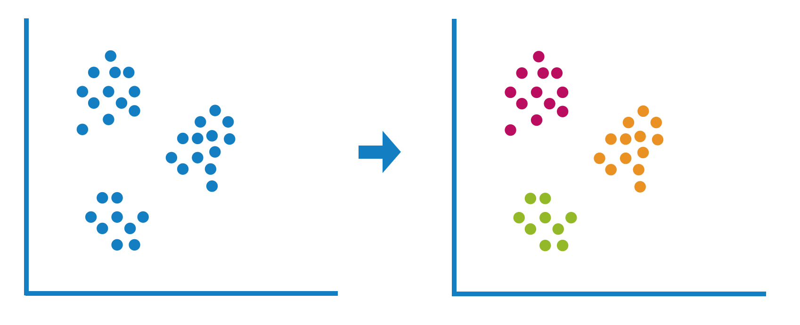
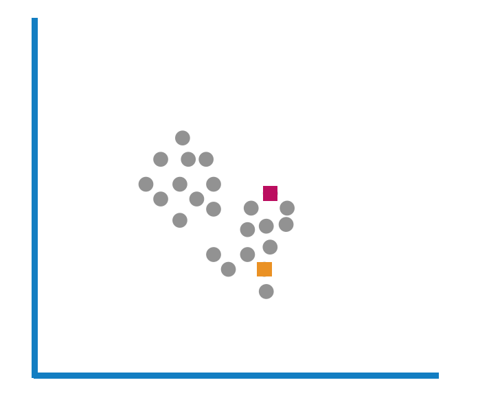
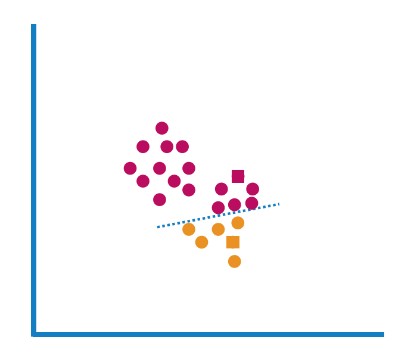
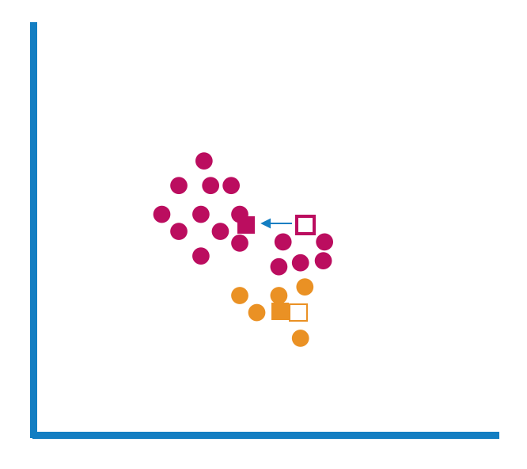
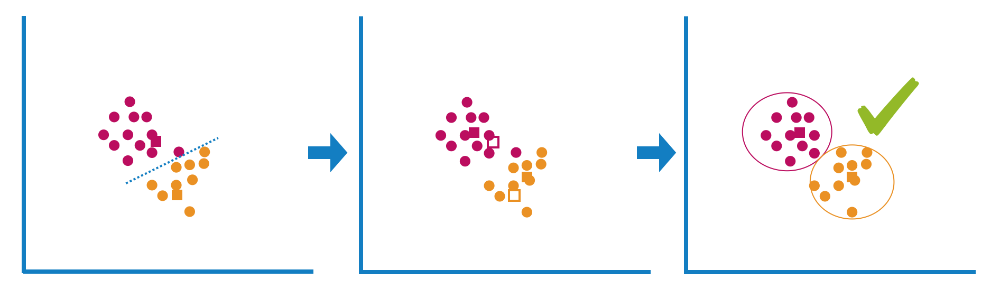
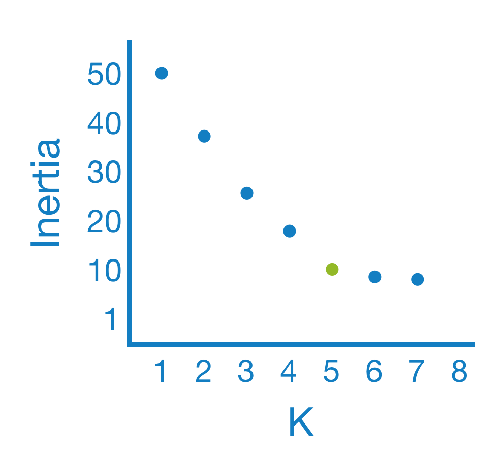
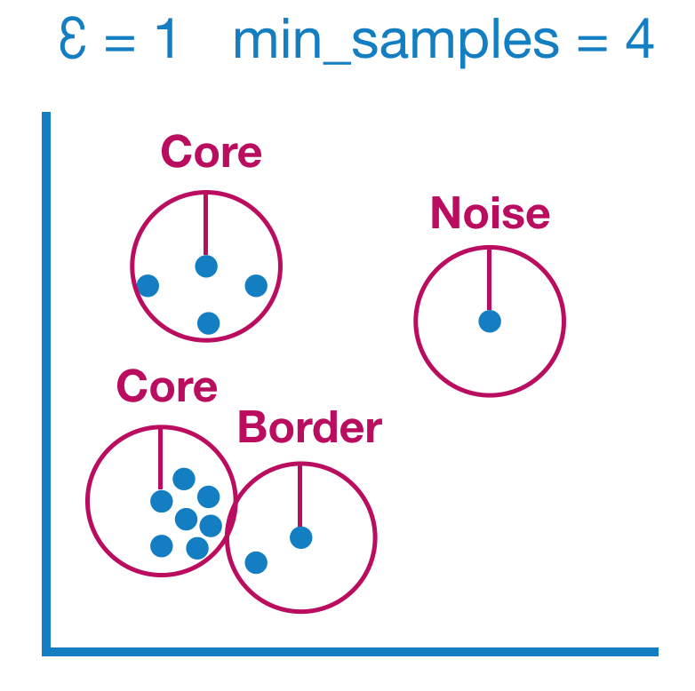

# Clustering-cheatsheet
This is a cheatsheet for clustering. The Notebooks contains K-Means and DBScan.

## Main Features
- Clustering overview
- K-Means example
- DBScan example

## What is Clustering
Clustering is an <strong>unsupervised </strong>  learning technique. This means the data does <strong>not contain any label/target</strong>.
  
The goal is to <strong>divide the data points into a number of groups -> the clusters</strong>. Each group should contain data points with similar characteristics. Data points within a cluster are more similar than data points in different clusters.
  
Clustering is therefore usefull to analyse an unlabeled datasets and find groups of data points with similar properties or features.

## Why use clustering?
A usecase for clustering which is simple to understand is the segmentation of customers.
  
Clustering can be used to find natural clusters. An example are customer segments. It makes it possible to find unknown properties of those groups and therefore give an answerer to the question "Who are my Customers?". Clustering makes it possible to find those segments and to characterize them for marketing purposes.
  
On the other hand clustering can be usefull to identify unusual data points. This can be used for outlier detection.

# Clustering algorithms
## K-means
Don´t get confused with k-means and k-nearest neighbor. K-means is a clustering algorithm whereas k-nearest neighbor is a classifier.
  
The simplest algorithm for clustering is probably the K-means algorithm. It uses the distance of a point to the center of a cluster to determine the cluster of the point.
  
A downside of K-means is that <strong>you have to choose the number of clusters, the K, by yourself.</strong>

### How K-means works
1. Select K and choose <strong>random points</strong> in the dataset as the center of a Cluster. The center is also called centroids.

2. Measure the euclidean distance of each point to the centroids. Every point is now a member of the cluster with the nearest centroid.

3. Calculate for every cluster the new centroid by taking the average of the assigned points.

4. repeat steps 2 and 3 until none of the points are changing clusters

### How to choose K, the amount of clusters?
In a two dimensional space it is easy to plot the data and find K simply by looking at the plot.
We want to use more features in our analysis so plotting and reading k is not a good approach.
  
There are several ways to determine K.
If you are interested you can read this article : https://medium.com/towards-artificial-intelligence/get-the-optimal-k-in-k-means-clustering-d45b5b8a4315
  
We will take a look at the Elbow method to choose k.
The elbow method uses the <strong>inertia</strong> of the clustering. <strong>The inertia is calculated as the sum of squared distance for each point to it´s closest centroid</strong>/the cluster. Therefore if the inertia is smaller the clusters should be denser.
  

When k increases, the inertia is getting smaller. You can see a k value where the inertia decreases slower. This is the "elbow" and it indicades a good fit for k.
However, the inertia is not as meaningful as we think. The more clusters we choose , the smaller the inertia. If we would choose as many clusters as instances the inertia would be 0. Because every point would be at a distance of 0 from its cluster.

### k-means summary
<table style="width:80%">
  <tr>
    <th style="background-color: #92BB0E">pros</th>
    <th style="background-color: #BD005E">cons</th>
  </tr>
  <tr>
    <td>easy to understand</td>
    <td>multiple starts with random picked centroids</td>
  </tr>
  <tr>
    <td>fast on many instances</td>
    <td>choose k manually</td>
  </tr>
    <tr><td></td>
    <td>equal treatment of all directions</td></tr>
</table>

## DBScan
"Density-Based Spatial Clustering of Applications with Noise"
  
The DBScan clustering algorithm is not meassuring the distance of a point to the cluster center. Instead it is <strong>density based</strong>.
  
Density based means that the algorithm uses the concept of reachability. Is a point reachable from several other points or is it a lonely point and therefore a outlier or noise point?
In contrast to k-means we dont have to choose k for DBScan. It produces the amount of clusters by itself.

### How DBScan works
The main concept is density. How many neighbours does a point have within a radius?
This radius is called epsilon and we have to choose this value. In addition we have to choose the min_samples/minPts i.e. the minimum amount of points within the radius to determine whether a point is a core point. It´s important to note that the point itself is included in the min_sample.
  
The Algorithm ends with 3 sorts of points:
- Core: these points have min_samples neighbors within epsilon 
- Border: these points are in the neighbourhod of a core point but have less than min_samples neighbors
- Noise: these points have too less neighbors and are therefore noise or outliers
  

### How to choose Ɛ/Epsilon and min_samples?
<strong>min_samples</strong>
There is no general way for choosing the min_samples/minPts. It heavily depends on the dataset and the result you want to get. If you choose min_samples very small, DBScan will create more clusters out of noise. So we shouldnt choose it too small.

<strong>Ɛ/Epsilon</strong>
To choose a good value for epsilon we can use an old friend. The elbow Method, but this time in a different way.
  
First we have to compute the k-nearest neighbor (K-NN) for every single data point. This gives us a k-distance plot of our dataset and we can understand the density distribution of our data.
When we plot the distances of each point we can use the elbow method to determine epsilon for DBScan.
  
Epsilon and min_samples depend strongly on the dataset. 

### DBScan summary
<table style="width:80%">
  <tr>
    <th style="background-color: #92BB0E">pros</th>
    <th style="background-color: #BD005E">cons</th>
  </tr>
  <tr>
    <td>also easy to understand</td>
    <td>doesn´t perform well as others when the clusters are of varying density</td>
  </tr>
  <tr>
              <td>no pre-set numbers of clusters</td>
    <td>different for high-dimensionality data because estimating epsilon will be difficult</td>
  </tr>
    <tr><td>can find outliers and unusual formed clusters well</td>
    <td></td></tr>
</table>